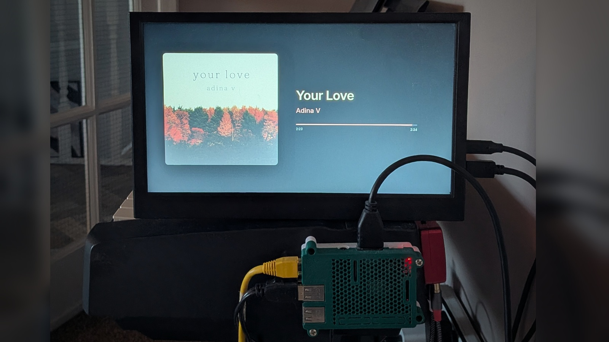

# Starlight

A minimal full-screen "now playing" display for Home Assistant. Point it at any
`media_player` entity and it shows the cover art, title, artist, album, and
progress for whatever that player is playing — on a cheap Raspberry Pi and a
spare screen.

It's deliberately narrow: one player, one screen, no controls, no library, no
settings UI. It's a display, not a remote — for a shelf next to your speakers, a
wall panel, or an old monitor by the turntable, anywhere you'd rather glance at
what's playing than reach for your phone.

The Pi only drives the screen. It doesn't have to be the thing making the sound:
Starlight reads the player's state from Home Assistant over the network, so the
audio can come from anywhere HA controls — Music Assistant, a Sonos, a Cast
device, AirPlay, an AVR, a squeezelite box — anything that shows up as a
`media_player`.



## How it works

A background thread polls Home Assistant once a second and caches the result.
The browser only ever talks to local Flask, so a Home Assistant restart or a
network blip just shows "Reconnecting…" and recovers on the next poll — no
crash, no white screen. Cover art is proxied and downscaled through Flask, and a
single accent colour is pulled from each cover for the progress bar and artist
line.

The same thread manages the monitor. While something plays the screen is on;
after a minute of nothing playing it drops the video signal (DPMS), and the
panel falls into its own backlight-off standby. It wakes the instant playback
starts.

Polling rather than a websocket is a choice, not a shortcut: on an always-on
appliance a persistent socket is one more thing to die silently, whereas a
one-second poll self-heals every cycle. The progress bar stays smooth because
the browser interpolates between polls.

## Requirements

- A Raspberry Pi (or any always-on Linux box) with a screen, running a Chromium
  kiosk — full walkthrough in [SETUP.md](SETUP.md). Developed on a Pi 3B;
  nothing here is 3B-specific.
- Home Assistant reachable on your network, with the player you want exposed as
  a `media_player` entity. How you produce that entity — Music Assistant, Sonos,
  Cast, AirPlay, an AVR integration — is up to you and out of scope here.

## Setup

The full path from a fresh OS flash to a running kiosk is in
[SETUP.md](SETUP.md). The short version, once the OS packages are in place:

```bash
git clone https://github.com/amiablealex/starlight.git ~/starlight-dashboard
cd ~/starlight-dashboard
./scripts/install.sh          # venv, deps, ~/.xinitrc, systemd service
nano .env                     # add your Home Assistant URL, token, and entity
sudo systemctl start starlight-dashboard
```

## Configuration

Everything lives in `.env` (copied from `.env.example`; gitignored):

| Variable | What it does |
| --- | --- |
| `HA_BASE_URL` | Home Assistant URL, no trailing slash |
| `HA_TOKEN` | Long-lived access token |
| `HA_ENTITY_ID` | The `media_player` entity to display |
| `DASHBOARD_PORT` | Port Flask listens on (default 8080) |
| `POLL_INTERVAL` | Seconds between polls (default 1.0) |
| `SCREEN_SLEEP_ENABLED` | Whether to power the screen down when idle |
| `SCREEN_SLEEP_GRACE` | Seconds of nothing playing before sleep |
| `SCREEN_CONTROL` | How to power the screen: `xset` (X11/KMS), `vcgencmd` (legacy Pi framebuffer), or `command` |
| `SCREEN_ON_CMD` / `SCREEN_OFF_CMD` | Your own commands, used when `SCREEN_CONTROL=command` |

Not sure of the entity id? With the service running,
`http://<pi>:8080/debug/players` lists every `media_player` Home Assistant
knows about.

## License

Code is MIT — see [LICENSE](LICENSE). The bundled
[Inter](https://github.com/rsms/inter) font is under the SIL Open Font License;
its licence travels with it in `static/fonts/Inter-OFL.txt`.

## Tech

Python (Flask, waitress, Pillow) on a Raspberry Pi. No build step and no
JavaScript framework — one HTML file, one stylesheet, one script.
